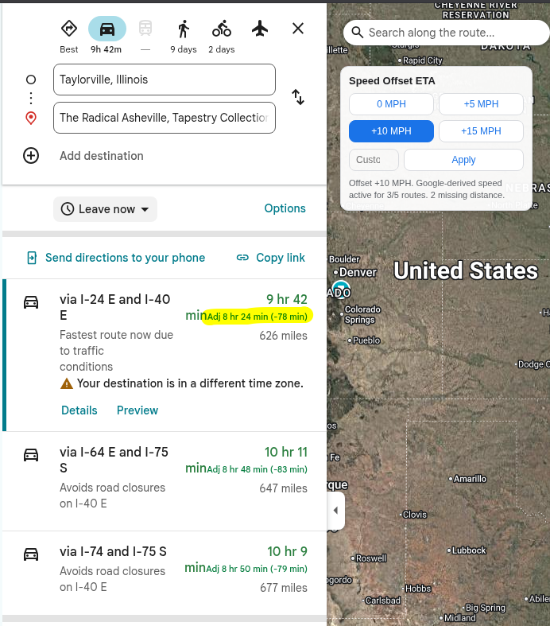

# Google Maps Speed Offset ETA

`Google Maps Speed Offset ETA` is a Brave/Chrome extension that adds quick speed
offset controls (`0`, `+5`, `+10`, `+15`, and custom MPH) directly inside Google
Maps route results and shows adjusted ETAs for each visible route.

## Screenshot

## Features

- In-page overlay on `google.com/maps` driving routes
- One-click presets: `0`, `+5`, `+10`, `+15`
- Custom MPH offset input
- Per-route adjusted ETA output
- Draggable overlay placement

## How It Works

The extension calculates an estimated adjusted time using:

`adjusted_time = original_time * (base_speed / (base_speed + offset))`

`base_speed` comes from Google route data for each visible route card:

`base_speed = route_distance / route_duration`

If route distance is not exposed for a card, the extension shows:
`Adj n/a (missing route distance)`.

This is an approximation for planning convenience, not a traffic simulator.

## Install (Unpacked)

1. Open `brave://extensions` (or `chrome://extensions`).
2. Enable **Developer mode**.
3. Click **Load unpacked**.
4. Select this project folder.

## Usage

1. Open `https://www.google.com/maps`.
2. Build a driving route.
3. Move the extension overlay if needed (drag by title).
4. Pick a preset or enter a custom MPH offset.
5. Read adjusted ETA values on visible route cards.

## Privacy

- No backend, no account, no external API calls
- Runs only on `https://www.google.com/maps/*`
- Uses route values already visible in the page

## Development Notes

- Manifest: `manifest.json` (MV3)
- Main logic: `content.js`
- Overlay styles: `content.css`
